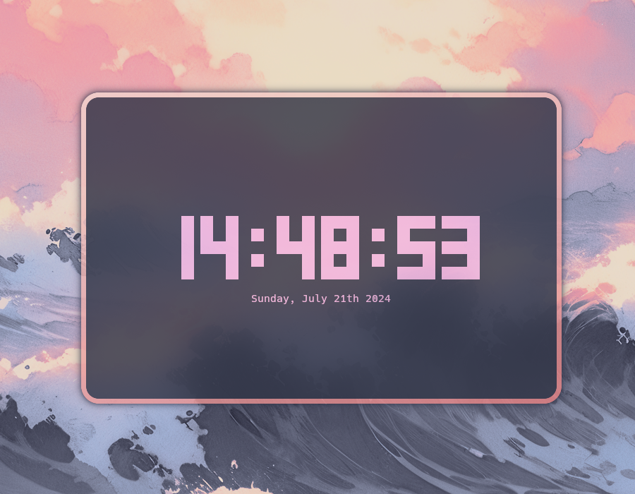

# clock-rs

clock-rs is a [tty-clock](https://github.com/xorg62/tty-clock)-inspired terminal clock built in pure Rust.



## Table of Contents

- [Installation](#installation)
  - [Dependencies](#dependencies)
  - [Steps](#steps)
- [Usage](#usage)
- [Configuration](#configuration)
  - [Example](#example)
- [Contributing](#contributing)
- [License](#license)


## Installation

### Dependencies

To install clock-rs, ensure you have [Rust](https://www.rust-lang.org/) along with Cargo installed.

### Steps

1. Clone the repository

    `$ git clone https://github.com/Oughie/clock-rs`

2. Navigate into the created directory

    `$ cd clock-rs`

3. Build the project using Cargo

    `$ cargo build --release`

After the build is complete, you can find the executable in the `target/release/` directory.  
Optionally, you can make the file globally executable.

On Linux, run the following commands:  

```
$ chmod +x target/release/clock-rs
$ sudo cp target/release/clock-rs /usr/local/bin/
```

You can then run the executable via the `clock-rs` command.

## Usage

To display the following message, run `$ clock-rs --help`.

```
Usage: clock-rs [OPTIONS]

Options:
  -c, --color <COLOR>  Specify the clock color [possible values: white, black, red, green, blue, yellow, magenta, cyan, reset]
  -x, --x-pos <X_POS>  Set the position along the horizontal axis [possible values: start, center, end]
  -y, --y-pos <Y_POS>  Set the position along the vertical axis [possible values: start, center, end]
      --fmt <FMT>      Use a custom date format, e.g. "%A, %B %dth %Y"
  -t                   Use the 12h format
  -h, --help           Print help
  -V, --version        Print version
```

## Configuration

clock-rs uses the [TOML](https://toml.io/en/) file format for its settings.  
By default, it is stored in the OS default configuration directory, under `clock-rs`.

On Linux: `~/.config/clock-rs/conf.toml`

This path can be changed using the environment variable `CONF_PATH`.  
Any argument passed in the command line will overwrite these settings.

### Example

An example `conf.toml` could look like this:

```toml
[general]
# Specify the color of the clock
# Possible values are: white, black, red, green, blue, yellow, magenta, cyan, reset (none)
color = "magenta"

[position]
# Specify the position along the horizontal and vertical axis
# Possible values are: start, center, end
horizontal = "center"
vertical = "center"

[date]
# Set a custom date format
fmt = "%A, %B %dth %Y"
# Specify, whether to use the 12 hour format
use_12h = false
```

## Contributing

Feel free to report bugs, suggest features or contribute code.
Any help is appreciated!

## License

Copyright © 2024 Oughie oughery@gmail.com

This repository is licensed under the Apache License 2.0 - See [LICENSE](LICENSE) for more information.
