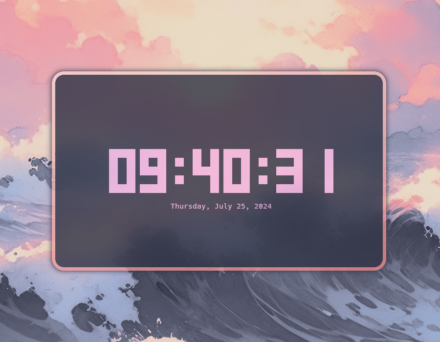

# clock-rs

A modern, digital clock that _effortlessly_ runs in your terminal.

[](LICENSE)
[](https://github.com/Oughie/clock-rs/stargazers)



## Table of Contents

- [Introduction](#introduction)
- [Installation](#installation)
  - [Dependencies](#dependencies)
  - [Steps](#steps)
- [Usage](#usage)
- [Configuration](#configuration)
  - [Fields](#fields)
  - [Example](#example)
- [Contributing](#contributing)
- [License](#license)

## Introduction

`clock-rs` is a terminal-based clock written in Rust, designed to be a new alternative to [tty-clock](https://github.com/xorg62/tty-clock). It offers several additional improvements, which include:
- the usage of a single configuration file to manage its settings, with the ability to overwrite them through the command line,
- a greater flexibility along with many additional features,
- and the active development that will bring many updates in the near future!

## Installation

### Dependencies

To install `clock-rs` from source, ensure you have [Rust](https://www.rust-lang.org/) along with Cargo installed.

### Steps

1. Clone the repository

    `$ git clone https://github.com/Oughie/clock-rs`

2. Navigate into the new directory

    `$ cd clock-rs`

3. Build the project using Cargo

    `$ cargo build --release`

After the build is complete, you can find the executable in the `target/release/` directory.  
Optionally, you can make the file globally executable.

On Linux, run the following commands:  

```sh
$ sudo cp target/release/clock-rs /usr/local/bin/
$ chmod +x target/release/clock-rs
```

You can then run the executable via the `clock-rs` command.

## Usage

```
Usage: clock-rs [OPTIONS]

Options:
  -c, --color <COLOR>        Specify the clock color
  -x, --x-pos <X_POS>        Set the position along the horizontal axis
  -y, --y-pos <Y_POS>        Set the position along the vertical axis
      --fmt <FMT>            Set the date format
  -t                         Use the 12h format
  -i, --interval <INTERVAL>  Set the interval in milliseconds
      --utc                  Use UTC time
  -s, --hide-seconds         Do not show seconds
  -h, --help                 Print help
  -V, --version              Print version
```

To exit the application, press either `Escape`, `q`, or `Ctrl-C`.

## Configuration

`clock-rs` uses the [TOML](https://toml.io/en/) file format for its settings.  
By default, the configuration file is named `conf.toml` and is stored in the OS configuration directory, within the `clock-rs` subdirectory.

On Linux: `~/.config/clock-rs/conf.toml`

This path can be changed using the `CONF_PATH` environment variable.  
Any argument passed in the command line will overwrite these settings.

### Fields

Here's a list of the available fields inside the `conf.toml` file.

| Field                     | Description                                | Possible values                                                                                                                  | Default      |
| ------------------------- | -------------------------------------------| ---------------------------------------------------------------------------------------------------------------------------------| ------------ |
| `general.color`           | Specify the color of the clock             | `"black"`, `"red"`, `"green"`, `"yellow"`,`"blue"`, `"magenta"`, `"cyan"`, or `"white"`. Optionally, prefix them with `bright-`. | `"white"`    |
| `general.interval`        | Set the interval in milliseconds           | Any Unsigned Integer, e.g. `499`.                                                                                                | `500`        |
| `position.horizontal`     | Set the position along the horizontal axis | `"start"`, `"center"`, or `"end"`.                                                                                               | `"center"`   |
| `position.vertical`       | Set the position along the vertical axis   | `"start"`, `"center"`, or `"end"`.                                                                                               | `"center"`   |
| `date.fmt`                | Set the date format                        | Any String, e.g. `%A, %B dth %Y`.                                                                                                | `"%d-%m-%Y"` |
| `date.use_12h`            | Use the 12h format                         | `true` or `false`.                                                                                                               | `false`      |
| `date.utc`                | Use UTC time                               | `true` or `false`.                                                                                                               | `false`      |
| `date.hide_seconds`       | Do not show seconds                        | `true` or `false`.                                                                                                               | `false`      |

### Example

The `conf.toml` file could look like this:

```toml
[general]
color = "magenta"
interval = 499

[position]
horizontal = "start"
vertical = "end"

[date]
fmt = "%A, %B %dth %Y"
use_12h = true
utc = true
hide_seconds = true
```

The default configuration can be found [here](public/default.toml).

## Contributing

Feel free to report bugs, suggest features or contribute code.  
Any help is appreciated!

## License

Copyright © 2024 Oughie

This repository is licensed under the Apache License 2.0 - See [LICENSE](LICENSE) for more information.
