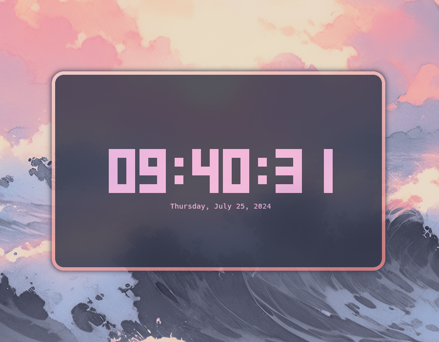

# clock-rs

[](https://crates.io/crates/clock-rs)
[](LICENSE)
[](https://github.com/Oughie/clock-rs/stargazers)

A modern, digital clock that _effortlessly_ runs in your terminal.



## Table of Contents

- [Introduction](#introduction)
- [Installation](#installation)
  - [Using Cargo](#using-cargo)
  - [Using a package manager](#using-a-package-manager)
  - [Building from source](#building-from-source)
- [Usage](#usage)
  - [Reloading the configuration](#reloading-the-configuration)
  - [Shell completion](#shell-completion)
- [Configuration](#configuration)
  - [Fields](#fields)
  - [Example](#example)
- [Contributing](#contributing)
- [License](#license)

## Introduction

`clock-rs` is a terminal-based clock written in Rust, designed to be a new alternative to [tty-clock](https://github.com/xorg62/tty-clock).  
It supports all major platforms and offers several improvements, which include:

- The use of a single configuration file to manage its settings, with the ability to override them through the command line,
- Many additional features such as a timer and a stopwatch,
- And greater flexibility as well as better user experience!

## Installation

### Using Cargo

To install `clock-rs` globally using [Cargo](https://crates.io/crates/clock-rs), simply run the following command:

```
$ cargo install clock-rs
```

You can then run the executable via the `clock-rs` command.

### Using a package manager

#### Arch Linux

A package is available from the [AUR](https://aur.archlinux.org/packages/clock-rs-git) (Arch User Repository). To install it, use your preferred AUR manager:

```
$ yay -S clock-rs-git
```

or manually clone from the AUR:

```
$ git clone https://aur.archlinux.org/clock-rs-git.git && cd clock-rs-git && makepkg -si
```

#### Homebrew

You can install `clock-rs` via [Homebrew](https://formulae.brew.sh/formula/clock-rs):

```
$ brew install clock-rs
```

#### NetBSD

A package is available from the official [pkgsrc](https://cdn.netbsd.org/pub/pkgsrc/current/pkgsrc/time/clock-rs/index.html) repositories. To install it, simply run:

```
# pkgin install clock-rs
```

#### NixOS

`clock-rs` is available in the [Nixpkgs](https://search.nixos.org/packages?channel=unstable&show=clock-rs&from=0&size=50&sort=relevance&type=packages&query=clock-rs) repository. To install it on NixOS, use the following command:

```
$ nix-env -iA nixos.clock-rs
```

If you use Nix on a different operating system, use either of the following commands:

```sh
$ nix-env -iA nixpkgs.clock-rs # Without flakes 
$ nix profile install nixpkgs#clock-rs # With flakes
```

> [!CAUTION]
> Using `nix-env` is generally unrecommended, since it requires you to manually manage installed packages. Consider using `$ nix-shell -p clock-rs` to make the application temporarily available instead.

You could also add the following to your `configuration.nix`:

```nix
environment.systemPackages = with pkgs; [
    clock-rs
    # ...
];
```

If you use Home-Manager to configure your dotfiles, you can use the following to set up `clock-rs` declaratively:

```nix
programs.clock-rs = {
  enable = true;

  settings = {
    general = {
      color = "magenta";
      interval = 250;
      blink = true;
      bold = true;
    };

    position = {
      horizontal = "center";
      vertical = "center";
    };

    date = {
      fmt = "%A, %B %d, %Y";
      use_12h = true;
      utc = true;
      hide_seconds = true;
    };
  };
};
```

### Building from source

If you prefer installing `clock-rs` from source, follow these steps:

1. Download the repository from the [releases](https://github.com/Oughie/clock-rs/releases/) page or clone it using `$ git clone https://github.com/Oughie/clock-rs`.

2. Depending on your platform, extract the archive and navigate into its directory.

3. Inside the directory, run `$ cargo build --release` to build the application manually. This will place the executable inside the `clock-rs/target/release` directory. However, if you want to install it globally instead, run `$ cargo install --path .`.

## Usage

```
Usage: clock-rs [OPTIONS] [COMMAND]

Commands:
  clock      Display the current time (default)
  timer      Create a timer (5 minutes if no time is specified)
  stopwatch  Start a stopwatch
  help       Print this message or the help of the given subcommand(s)

Options:
  -c, --color <COLOR>        Specify the clock color
  -i, --interval <INTERVAL>  Set the polling interval in milliseconds
  -B, --blink                Set the colon to blink
  -b, --bold                 Use bold text
  -x, --x-pos <X_POS>        Set the position along the horizontal axis
  -y, --y-pos <Y_POS>        Set the position along the vertical axis
      --fmt <FMT>            Set the date format
  -t                         Use the 12h format
      --utc                  Use UTC time
  -s, --hide-seconds         Do not show seconds
  -h, --help                 Print help
  -V, --version              Print version
```

```
Create a timer (5 minutes if no time is specified)

Usage: clock-rs timer [OPTIONS]

Options:
  -S, --seconds <SECONDS>  Add seconds to the timer
  -M, --minutes <MINUTES>  Add minutes to the timer
  -H, --hours <HOURS>      Add hours to the timer
  -k, --kill               Terminate the application when the timer finishes
  -h, --help               Print help
```

```
Start a stopwatch

Usage: clock-rs stopwatch

Options:
  -h, --help  Print help
```

> [!NOTE]
> If no command is specified, the `clock` command is used by default.  
> Therefore, running `$ clock-rs clock` or simply `$ clock-rs` will both display the current time.
> 
> The timer converts time units by itself, so that e.g. `$ clock-rs timer -M 90` starts a timer with 1 hour and 30 minutes.  
> The maximum timer duration is 99 hours, 59 minutes and 59 seconds.

Press <kbd>P</kbd> to toggle the pause on the timer or stopwatch, and <kbd>R</kbd> to restart.  
To exit the application, press <kbd>Escape</kbd>, <kbd>Q</kbd>, or <kbd>Ctrl + C</kbd>.

### Reloading the configuration

You can reload the configuration file without restarting the application  
by either pressing <kbd>Ctrl + R</kbd> or sending the `SIGUSR1` signal on Unix-like systems.  
Note that this will overwrite any settings previously set by command-line arguments.

### Shell completion

Shell completion files are automatically generated and placed inside the `target/completions` directory.  
The following shells are supported: `Bash`, `Zsh`, `Fish`, `PowerShell`, `Elvish`

## Configuration

`clock-rs` uses the [TOML](https://toml.io/en/) file format for its settings.
By default, the configuration file is named `conf.toml` and is stored in the OS configuration directory, within the `clock-rs` subdirectory.

| Platform | Configuration file path                                |
| -------- | ------------------------------------------------------ |
| Linux    | `~/.config/clock-rs/conf.toml`                         |
| MacOS    | `~/Library/Application Support/clock-rs/conf.toml`     |
| Windows  | `C:\Users\%USERNAME%\AppData\Local\clock-rs\conf.toml` |

You can change this path by setting the `CONF_PATH` environment variable.  
If you wish to run the application without automatically using the existing `conf.toml` file, you can set `CONF_PATH` to `None`.  

Any argument passed in the command line will override the settings inside the `conf.toml` file.

### Fields

Here is a list of the available fields inside the `conf.toml` file.

| Field                     | Description                                | Possible values                    | Default      |
| ------------------------- | ------------------------------------------ | ---------------------------------- | ------------ | 
| `general.color`           | Specify the color of the clock             | `"black"`, `"red"`, `"green"`, `"yellow"`, `"blue"`, `"magenta"`, `"cyan"`, or `"white"`. Optionally, prefix them with `"bright-"` or use a hex color code in the form of `"#rrggbb"`. | `"white"` |
| `general.interval`        | Set the polling interval in milliseconds   | A non-zero unsigned integer, e.g. `250`. | `200`        |
| `general.blink`           | Set the colon to blink                     | `true` or `false`.                 | `false`      |
| `general.bold`            | Use bold text                              | `true` or `false`.                 | `false`      |
| `position.horizontal`     | Set the position along the horizontal axis | `"start"`, `"center"`, or `"end"`. | `"center"`   |
| `position.vertical`       | Set the position along the vertical axis   | `"start"`, `"center"`, or `"end"`. | `"center"`   |
| `date.fmt`                | Specify the date format                    | A [chrono format](https://docs.rs/chrono/latest/chrono/format/strftime/index.html) string, e.g. `"%A, %B %d, %Y"`.  | `"%d-%m-%Y"` |
| `date.use_12h`            | Use the 12h format                         | `true` or `false`.                 | `false`      |
| `date.utc`                | Use UTC time                               | `true` or `false`.                 | `false`      |
| `date.hide_seconds`       | Do not show seconds. This is ignored when the active time format includes milliseconds. | `true` or `false`. | `false` |
| `clock.fmt`               | Specify the clock format                   | `"hh:mm:ss"` or `"hh:mm:ss.SSS"`.  | `"hh:mm:ss"` |
| `counter.fmt`             | Specify the timer and stopwatch format     | `"hh:mm:ss"` or `"hh:mm:ss.SSS"`.  | `"hh:mm:ss"` |

### Example

The `conf.toml` file could look like this:

```toml
[general]
color = "magenta"
interval = 250
blink = true
bold = true

[position]
horizontal = "center"
vertical = "center"

[date]
fmt = "%A, %B %d, %Y"
use_12h = true
utc = true
hide_seconds = true

[clock]
fmt = "hh:mm:ss.SSS"

[counter]
fmt = "hh:mm:ss.SSS"
```

The default configuration can be found [here](public/default.toml).

## Contributing

Feel free to report bugs, suggest features or contribute code.  
Note that `clock-rs` is intentionally minimal. Features that go beyond  
displaying time are unlikely to be added, although this can always be discussed.

## License

Copyright © 2024 Oughie

This repository is licensed under the Apache License 2.0 - See [here](LICENSE) for more information.
